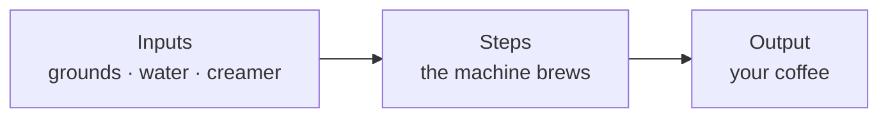

<!--
LECTURE STATUS: voice-core APPROVED by Dakota 2026-06-24 (author_status: dakota-authored). Finalized.
Repo push still gated on: the publish-lock CI gate (oneshot_build_requirements.md §5, gate 1) AND the remaining Week-1 drafts (Unit 1) — a repo push syncs ALL lectures, so don't push until 01 is finalized or the gate suppresses drafts.
author_status legend: dakota-authored = Dakota's, final · assistant-mechanical = assistant-drafted · assistant-shared = shared (Dakota narrates, assistant drafts).
Spine: Unit 0 · Objectives → MSU Denver obj 12 → ABET SO-1, SO-6 / CS2023 SE.
-->

# What Is Computation (and How Do Programs Actually Run)?

<!-- author_status: dakota-authored | section: Frame -->
Oh, hello there 👋 and welcome to the very first real lesson. Before we touch a single line of Python, let's answer the question hiding under this whole course: **what *is* computation, anyway?**

I'll be honest with you about how I started this answer: I Googled it. (I do this a lot — it's what every good programmer does, and you should never feel bad about it either.) Here's what came back:

> Computation is the process of calculating or determining an outcome by following a well-defined set of rules, algorithms, or mathematical steps. It involves taking an initial set of inputs and transforming them into a predictable output.[^def]

*(Quick gut-check before we lean on that: it's an AI-generated search summary, not gospel. I tracked down where it seems to come from and cited it below — always worth knowing who you're quoting, even when it's a computer handing you the answer.)*

That's a mouthful. Let's break it down into the part that actually matters:

<div class="grid cards" markdown>

-   :material-target:{ .lg .middle } **What's going to happen…**

    ---

    The result you're after — the *output*.

-   :material-format-list-numbered:{ .lg .middle } **…when a set of steps/rules are followed…**

    ---

    A specific, well-defined *recipe* the machine follows.

-   :material-check-circle-outline:{ .lg .middle } **…in a way that makes the outcome predictable.**

    ---

    Same inputs + same steps → the *same result*, every time.

</div>

That's it. That's the whole idea. And here's why I want you to care about it before anything else: **this applies to everyone — technical and non-technical folks alike.**

In my case, I'm a Data Engineer. My whole job is building things that pull and transform data *reliably and accurately every time* — same inputs, same steps, same output. But you don't have to write code for this to matter to you. Think about buying groceries: if there's a specific set of groceries you always buy, wouldn't it be nice to have them show up on a consistent schedule with a consistent result? (Hint, hint — there's an entire *market* built on exactly that: think Amazon's Subscribe & Save, or grocery delivery like Instacart and Walmart+.) Computation is in all of our lives. Some of us will use it directly in our jobs, some directly in our personal lives, and some of us indirectly without ever thinking about it.

And here's the encouraging part: computers are more accessible than they have ever been. I'd bet most of you reading this are holding one right now — your cell phone. In fact, the phone in your pocket has **far more computing power than the systems that put a person on the moon**[^moon]. So when you watch a movie with a "hacking" scene, or someone hammering 200 keys a minute like they're casting a spell — it can look like magic. I'm here to tell you: **you can do this too, and it's not nearly as hard as you think.**
<!-- /author_status -->

[^moon]: A modern smartphone dwarfs the 1960s NASA flight computers by an enormous margin — see [EIT](https://www.eit.edu.au/smartphones-hold-more-tech-than-60s-nasa-computers/) and [this 2025 iPhone teardown comparison](https://global.dday.it/2025/10/08/509/apple-iphone-17-review-ordinary-but-only-on-the-surface).

[^def]: That definition is an AI-generated search summary — it appears synthesized from [Wolfram MathWorld — *Computation*](https://mathworld.wolfram.com/Computation.html) and [this CS StackExchange discussion](https://cs.stackexchange.com/questions/43938/what-exactly-is-computation).

---

## What you'll be able to do

<!-- author_status: assistant-mechanical | section: Objectives -->
By the end of this lesson, you'll be able to:

1. **Explain, in your own words, what computation is** — inputs, a set of well-defined steps, and a predictable output.
2. **Describe what a program is** and give an example of one from your own life.
3. **Explain why "exact" and "in order" matter** to how a machine runs your instructions.
4. **Recognize that programming is a language** with its own rules — and that you already learn rules like this all the time.

!!! abstract "Why this counts (outcomes alignment)"
    This lesson aligns with **MSU Denver CS 1050 objective 12** (state the steps of the software process) and, more broadly, **ABET SO-1** (analyze a problem) and **SO-6** (apply CS fundamentals) under the **CS2023 SE** knowledge area. *(Alignment, not an accreditation claim — see [disclaimers](https://dakotalearns.com/disclaimers/).)*
<!-- /author_status -->

---

## So… what is computation, really?

<!-- author_status: dakota-authored | section: Core explanation -->
Let's make this concrete, because a definition is just words until you can *see* it.

My favorite everyday example is your **coffee pot**. Stay with me. ☕

A coffee maker takes a specific set of **inputs** (beans or grounds, water, maybe creamer if that's your thing). It then runs a fixed set of **operations** (it brews, to its own specifications). And out the other end comes the **output**: a heavenly beverage that protects everyone around you in the morning.



Notice that this is the *exact same shape* as the definition we Googled: **inputs → a well-defined set of steps → a predictable output.** Hold onto that shape, because you're going to see it everywhere for the rest of this course.

Now here's the part that explains **how a program actually runs** — and it comes in two words: *exact* and *in order*.

- **Exact.** A machine does *exactly* what it was built or told to do — no more, no less. If I have a $20 drip carafe I grabbed at Walmart, it is not going to make me a flat white or a vanilla latte. Its "spec" is black coffee, and black coffee is what I get. The machine doesn't guess what I *meant*; it does what it actually does.
- **In order.** The steps run in a sequence, and the sequence matters. My cheap coffee maker might be built so that I load the grounds **first**, *then* the water — do it in the wrong order and it simply won't work.

Put those together and you've got the big secret of this whole lesson: **computation and programming are exactly the same idea.** A computer, like that coffee pot, follows your steps *exactly* and *in order*. It is not reading your mind — it is following your instructions. That's not a limitation to fear; once you really believe it, it becomes the thing that makes everything else make sense.
<!-- /author_status -->

### Okay, so what's a "program"?

<!-- author_status: dakota-authored | section: Core explanation (cont.) -->
A **program** is just *a set of steps followed by a machine* — and in our case, that machine is almost always a computer (and yes, the phone in your pocket counts as one).

Programs can be tiny. A simple one I built recently was a little shortcut to open folders on my Mac in an app that Apple doesn't list in the normal "Open with…" menu. That's a program.

Or they can be big. Years ago, when I was first learning Python, I rebuilt the card game *Memory* — complete with a timer and a leaderboard. There was **input** (someone running my game and playing it), there were **steps** (flipping cards, removing matched pairs, tracking your progress), and there was **output** (your final score, the leaderboard, and a little arcade-style prompt for your name). Big or small — same shape. Input, steps, output.
<!-- /author_status -->

### Programming is a language (and you already learn languages)

<!-- author_status: dakota-authored | section: Core explanation (cont.) -->
This finally clicked for me in one of the most trying courses I ever took — Theory of Computation. (It wasn't taught or supported well, and I struggled, and that's okay; I still walked away with something worth keeping.) Here it is:

**Programming is a language, like any other.** A language has **syntax** (the exact words and symbols you write) and **semantics** (what those words actually *mean* — the rules of the language). Together, those two things power every piece of technology around you.

And honestly? You already do this. Go back to coffee for a second: the world of coffee has its own vocabulary and its own rules for how you *use* that knowledge. "Pull a double shot," "bloom the grounds" — that's the language of coffee. Learning to program is the same kind of thing. You're not becoming a different person; you're picking up one more language, the same way you've picked up others.
<!-- /author_status -->

---

## Let's trace one together

<!-- author_status: assistant-shared | section: Worked example -->
We don't have any Python yet — that's next lesson — so let's "run" a program we both already know: making coffee. Watch how a machine would have to follow it.

**Program: `make_coffee`**

```text
1. Add grounds to the basket.
2. Add water to the reservoir.
3. Press start.
4. Wait for the brew to finish.
5. Pour into a mug.
```

Trace it the way the machine would — one step at a time, top to bottom:

| Step | What the machine does | State after |
|---|---|---|
| 1 | grounds in basket | basket: full |
| 2 | water in reservoir | reservoir: full |
| 3 | start pressed | brewing… |
| 4 | brew finishes | pot: full of coffee |
| 5 | pour | mug: full ☕ |

Now break the rules on purpose and feel why *exact* and *in order* matter:

- **Out of order:** press start (step 3) *before* adding water (step 2). Nothing brews. The machine didn't "figure it out" — it did exactly what the steps said, in the order they came.
- **Wrong input:** load tea leaves instead of coffee grounds. The machine still runs every step perfectly… and hands you something you didn't want. *Garbage in, garbage out.*

That's the entire mental model you need going forward: **the computer follows your steps exactly, in order, on the inputs you actually gave it.**
<!-- /author_status -->

---

## Check yourself

<!-- author_status: assistant-mechanical | section: Retrieval checks -->
Quick, low-stakes retrieval — no grade, just to see if it stuck. Try each before you open the answer. *(These collapsible self-checks will become auto-scoring widgets once the site's quiz renderer ships.)*

??? question "1. In one sentence, what is computation?"
    Taking some **inputs** and transforming them into a **predictable output** by following a **well-defined set of steps**.

??? question "2. A friend says, 'My computer did something I didn't tell it to.' Using today's lesson, what's a more accurate way to describe what probably happened?"
    The computer did *exactly* what it was instructed to do — the instructions (or the inputs) just weren't what the friend *thought* they were. The machine follows the steps, in order; it doesn't improvise.

??? question "3. True or false: the order of a program's steps usually doesn't matter."
    **False.** Steps run *in order*, and the order often changes the result — like adding water before grounds, or pressing start before either.

??? question "4. Name one program from your own life that isn't a 'computer' program."
    Lots of good answers: a coffee maker, a microwave dinner's instructions, a recipe, a smart-home routine, an automatic sprinkler timer. Anything that takes inputs and follows fixed steps to a predictable output.
<!-- /author_status -->

---

## Your turn (practice)

<!-- author_status: assistant-shared | section: Independent practice -->
No code required. Pick something you do on autopilot — making coffee, a morning routine, a game you know — and write it out as a **program**:

1. List the **inputs**.
2. List the **steps**, in order.
3. State the **output**.
4. Then break it: change *one* input, or swap *two* steps, and describe what the (very literal) machine would now produce.

Keep it short. The goal is just to start seeing the input → steps → output shape in the world around you.
<!-- /author_status -->

---

## Things people get wrong (FAQ)

<!-- author_status: assistant-shared | section: Misconceptions & FAQ (Dakota seeded #1) -->
**"Don't I have to be some kind of nerd, or learn an entire programming language, to do this?"**
Nope — and I mean that. Technology keeps getting more accessible to everyone. My wife recently set up a routine in our smart-home system to turn the lights on at a certain time of day. She doesn't work in tech and doesn't code for fun, but she built a real *program* through a visual interface all the same. The biggest takeaway of this whole lesson: **this is something everyone can do.** What you do with it is up to you.

**"Why are we doing coffee makers instead of writing code already?"**
Because the *idea* is the hard part, not the typing. Once "inputs → exact, in-order steps → predictable output" feels obvious, Python is mostly learning the words for things you already understand. We write your first real program in the very next lesson.

**"Do I need to memorize 'syntax' and 'semantics'?"**
Not to pass — they're here so the words don't surprise you later. You'll find them in **Key terms** below. We'll mostly just say "the code you write" and "what it means."
<!-- /author_status -->

---

## Say it in your own words (communicate)

<!-- author_status: dakota-authored | section: Communicate -->
One of the most underrated skills in this field is explaining a technical idea to a normal human being. So let's practice it from day one.

In **3–4 sentences**, explain to a friend who's never coded what a "program" is — and use your *own* everyday analogy, not my coffee pot. If you can make someone who's nervous about computers nod and go "oh, that's it?", you've understood this better than most.
<!-- /author_status -->

---

## Key terms

<!-- author_status: assistant-mechanical | section: Key terms (vocab convention P12) -->
| Term | Plain-language meaning |
|---|---|
| **Computation** | Turning inputs into a predictable output by following a well-defined set of steps. |
| **Program** | A set of steps a machine follows. |
| **Input / Output** | What goes *into* a program; what comes *out* of it. |
| **Syntax** | The exact code you type. |
| **Semantics** | What that code actually means — the rules of the language. |

*(Durable terms also live in the site-wide [Glossary](https://dakotalearns.com/glossary/).)*
<!-- /author_status -->

---

## Summary & what's next

<!-- author_status: assistant-mechanical | section: Summary + spaced hooks -->
The one shape to remember:

> **Inputs → a well-defined set of steps → a predictable output**, run *exactly* and *in order*.

- A **program** is the *recipe* — the written set of steps. **Computation** is what happens when a machine actually *follows* that recipe, on real inputs, to produce an output.
- A machine follows your instructions *exactly* and *in order* — it isn't reading your mind (the Walmart coffee pot won't make you a latte, and it won't brew before you add water).
- **Programming is a language** — syntax + semantics — and you already learn languages like this all the time.

**Next lesson (Unit 1):** you'll write and run your *first real program*, and meet the building blocks every program is made of — **values, types, and variables**. Remember the "a name for a thing" idea — it comes back in a big way later when we get to how Python really stores your data.
<!-- /author_status -->

<!-- author_status: dakota-authored | section: Sign-off (Dakota's standard skeleton — confirm/customize the day) -->
Thanks for taking the time to read this first lesson. Until the next time we learn something together, have a wonderful day! 👋
<!-- /author_status -->
